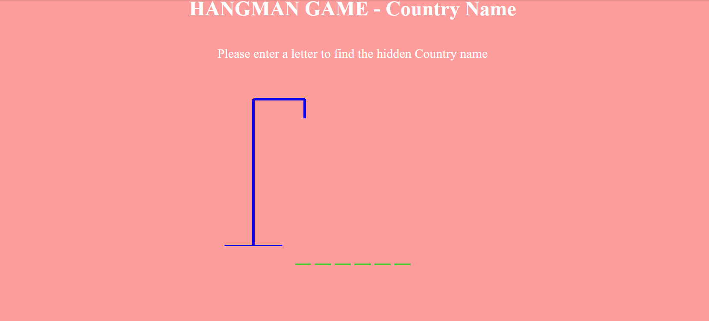

# HangmanGame-JS

# Hangman Game - Country Name

This is a simple Hangman game where players try to guess the name of a country. The game provides a fun way to test your knowledge of countries around the world.

## Table of Contents

- [Getting Started](#getting-started)
- [How to Play](#how-to-play)
- [Features](#features)
- [Contributing](#contributing)
- [License](#license)

## Getting Started

To play the Hangman game, follow these steps:

1. Clone or download this repository to your local machine.
2. Open the `index.html` file in your web browser.
3. Start guessing letters to discover the hidden country name.
4. If you guess the name correctly, you win! Otherwise, try again.

## How to Play

- The game randomly selects a country name from a predefined list.
- You can guess one letter at a time by typing it on your keyboard.
- If the letter is part of the country name, it will be revealed.
- If the letter is not part of the country name, it will be displayed as a wrong guess.
- Be careful! You have a limited number of wrong guesses before the game ends.
- Win the game by guessing the entire country name or lose by running out of guesses.

## Features

- Randomly selects country names for endless gameplay variety.
- Visual representation of the hangman as you make wrong guesses.
- Keeps track of both correct and wrong guesses.
- Provides feedback with win and lose messages.
- Play again button for starting a new game.

## Contributing

Contributions are welcome! If you have any suggestions, bug reports, or feature requests, please open an issue or create a pull request.

1. Fork the project.
2. Create your feature branch (`git checkout -b feature/your-feature`).
3. Commit your changes (`git commit -m 'Add some feature'`).
4. Push to the branch (`git push origin feature/your-feature`).
5. Open a pull request.

## License

This project is licensed under the MIT License - see the [LICENSE](LICENSE) file for details.

---

Enjoy playing Hangman! Have fun and learn about countries from around the world.
